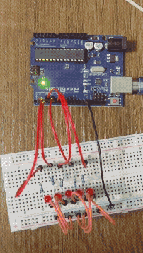

## 5 bit Binary Counter

I decided to hook up 5 LEDs next to each other to create a binary counter. 

Basically, this code will cause the binary counter to count up from 1 to 32. According to binary, 5 bits can represent numbers from 0 to 32. The LED are arranged linearly to represent each of the 5 bits.

Initially I was going to make the code VERY long - individually writing code for each of the LED blinks all the way from 1 to 32. This would have made it extremely long. From my knowledge of using python, I knew that no code had to be this long. There is always a way to make it shorter and faster. So, I did some thinking and some research and realised how I could make my code way shorter.

Each of the 5 bits in a binary number have the values 2, 4, 8, 16 and 32 respectively (going from the least significant bit onwards). The loop() function in the code will always go on repeatedly, so I can assign a variable to become the counter and increment it every iteration of the loop. I realised that the "&" symbol can be used as a bitwise AND operation and using it with a number such as "1" or "2" will convert that number to binary and perform the operation. For example, when the counter variable has a value of 10, the first bit of the binary number representing 10 is 1 and the binary number representing 1 is just 1. 1 AND 1 is TRUE which will give a voltage value of HIGH. So, the LED that represents the first bit will turn on as the result will be TRUE. Next LED 2 will stay off as as the second bit of 10 is 0. 0 AND 1 is FALSE. This continues every iteration and as the count variable's value keeps changing, The LED output will also change accordingly.

Finally to reset the value of count after displaying the number 32, I used a simple if statement.

Here is a GIF of the circuit:

