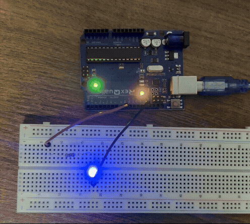

## analogWrite() command

This program is very simple. I learnt about the analogWrite() command and how it can simulate analog signals and vary the brightness of an LED by simply changing the flickering speed. So, using this knowledge I created a program where the LED slowly dims and becomes brighter by using two for loops - one to increase the voltage and the other to decrease the voltage to create this effect.

Here is a gif of the circuit:

