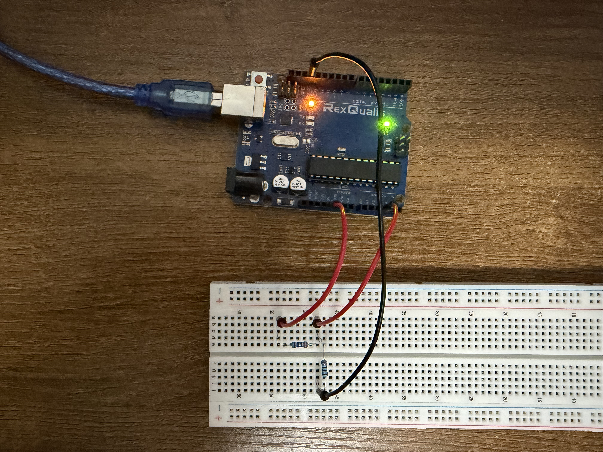

# analogRead command and Serial monitor

This is a simple voltage divider circuit built using two 330 ohm resistors to read analog voltage. It reads the analog voltage on the A3 pin and prints it to the serial monitor.

## How it works

The voltage supply of the Arduino board is 5V whereas the analog pin can only give values between 0-1023. So, this code converts that value into a suitable voltage reading in the range 0-5V. Since I used two similar resistors, the value of the voltage will be divided by 2 so the output should be around 2.5V.

## Image

