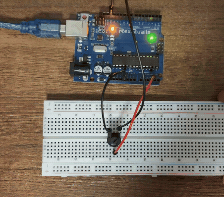
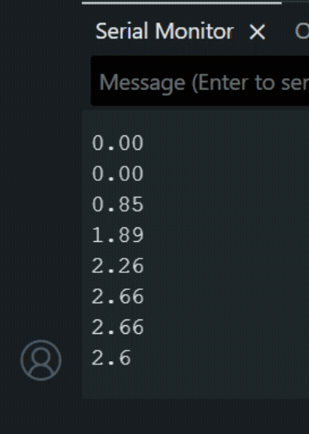

# Potentiometer

The circuit here also reads analog voltage, but from a potentiometer. The potentiometer comprises of 3 pins where the first two connect to the power supply and ground. The third pin provides the analog voltage depending on how far the potentiometer is turned. So, the voltage produced by a potentiometer can vary.

## Simple Circuit
This is the circuit. Turning the knob on the potentiometer changes the voltage.

 

This gif shows the view of the serial monitor where the voltage reading from the potentiometer is printed.

## Circuit with an led warning

