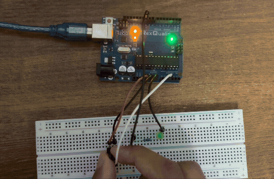

# Dimmable LED

This circuit adds an LED, and converts the analog signal from the potentiometer into a value to be given to an LED to change its brightness.

## How this works

The potentiometer actually gives values on a scale of 0-1023 while the LED accepts values from 0-255. That is why the code converts it. The LED is connected to a digital pin that is capable of sending an analog signal. Of course, the led does not actually dim and brighten. It basically fakes it and our human eyes see it as changing brightness. All that is happening is extremely fast flickering. The flickering rate varies causing the brightness changing effect.

## Working circuit

