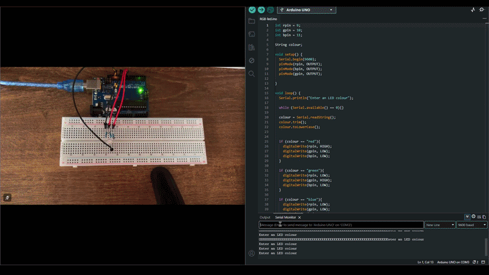

# RGB LED

The circuit here seems simple, but it has a very versatile and useful component. The RGB led can be used to produce any colour using the three primary colour bulbs inside it.

# How this circuit works
The circuit accepts input from the user, converts the word into lowercase to make checking easier and changes the colour of the led accordingly. This program is very powerful as it can easily be modified to produce any colour. As each led can also accept an analog value from 0-255 varying the brightness. If the user knows the exact values it can make the colour outputs very versatile.

# Circuit

