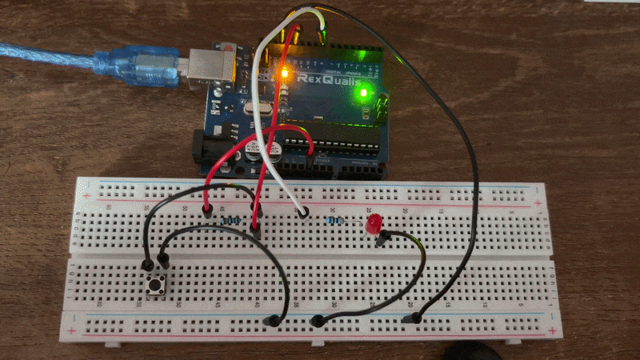
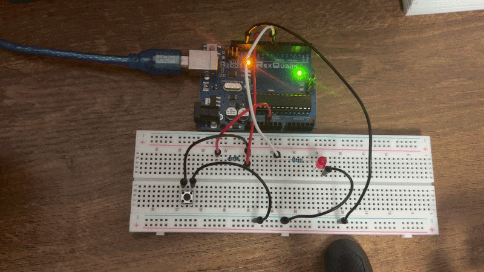

# Pushbuttons

I have done a total of three projects using pushbuttons. The first (Pushbutton.ino), is a very basic circuit where an LED switches on if the pushbutton is pressed. The second (pushbutton-toggle.ino) is slightly more complicated as it requires the use of more advanced logic in the code to get it working. The third (dimmable-led-with-buttons.ino), uses two pushbuttons to control the brighness of the LED.

Now I will describe each project separately.

## Pushbutton.ino
This project was easy to program. The default value of the pushbutton is 1. So, the only thing I needed to look out for was the turn changing to a 0 when pressed. A simple digitalRead() command and if statement finished the job.

### GIF

## pushbutton-toggle.ino
Now this project was very interesting. I did get it to work pretty easily, but I quickly realised an issue. Luckily I resolved it after understanding how to look at the solution in a different way.

### Initial mistake
Initially, when I pressed the button it worked but only about 70-80% of the time. If the led was off and I pressed the button, it would turn on and then off. I thought the delay was too less so I increased it but that caused the button press to not get detected at times if I did not hold down long enough. That is when I realised it - I was checking for the pushbutton value to be 0 to toggle the led, so when I held down long enough, it detected 0 again and again causing the led to blink. I changed my approach. I instead checked for the change from 1 to 0 and 0 to 1. So the led will change state only when there is a press and not when there is a hold.

### GIF

## dimmable-led-with-buttons.ino
When I hooked up the circuit for this project, I was actually surprised because somehow I got it working on the first try. All this does is it detects if the pushbuttons is pressed and if it is it increases the value written to the led (0-255). This causes the led to become brighter and vice versa for the other pushbutton. I thought increasing the value by 1 was too less so I changed it to 5, this makes the change more visible and faster.

As an addition, I added a buzzer that will buzz when I try to increase the brightness when it is already at 255 or decrease the brightness when it is already at 0. 

### Video

