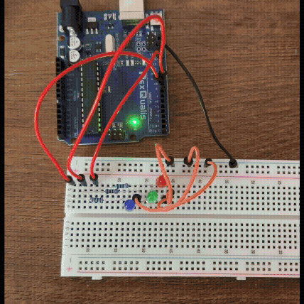

## Advanced LED Blinking
This program takes a step further from the previous program. Now, I have added onto the knowledge I gained about connecting circuits from the previous program and added 3 bulbs. With the use of for loops and using separate pins for each bulb I was able to control each bulb separately for any number of blinks.

